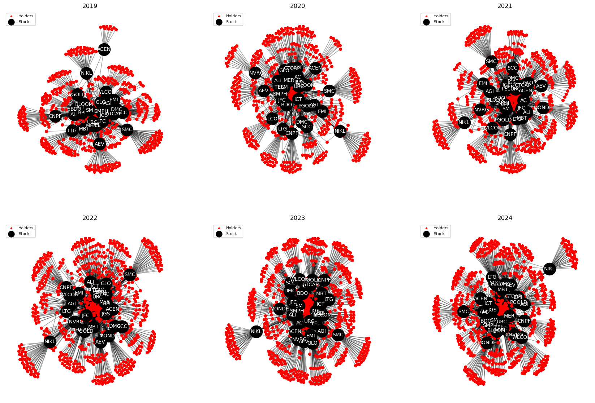
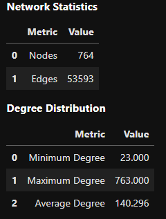
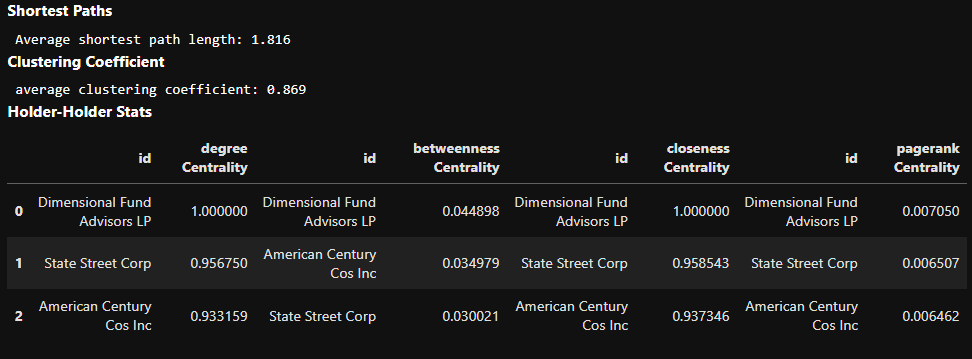
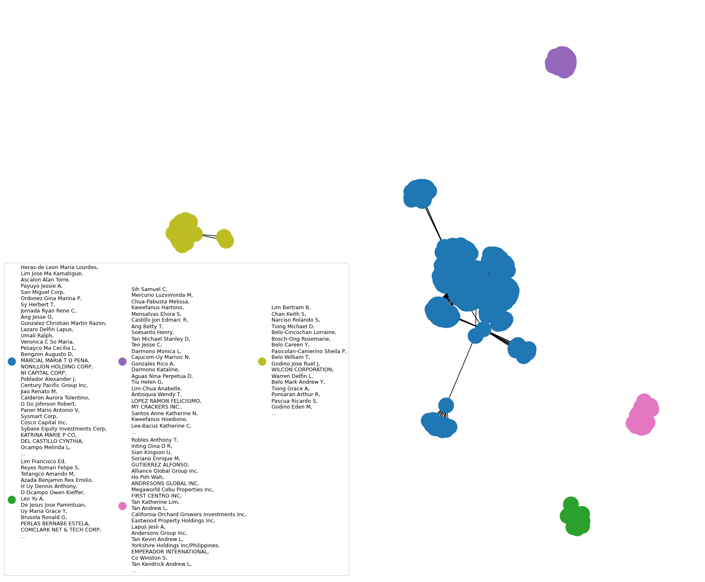

# Network Science Technical Report

## MAPPING INFLUENCE: Exmining PSEi's Top Shareholders

- [View PDF Report](paper.pdf)
- [Download HTML Report](Tech_Report.html)
- [View Notebook](Tech_Report.ipynb)

## Introduction
The Philippine Stock Exchange Index (PSEi) represents the top 30 publicly listed companies on the Philippine Stock Exchange, showcasing the most significant players by market capitalization. To promote transparency, listed companies are mandated to disclose their top 100 shareholders quarterly. This regulation sheds light on key stakeholders, including individual investors, institutional entities, and offshore institutions, whose significant voting power influences corporate policies.

This report leverages network science to analyze shareholder connections and identify the top movers shaping the local stock exchange. By mapping these relationships, we aim to provide deeper insights into the forces driving the PSEi and the broader investment landscape.

## 2019-2024 Bipartite view of listed stocks and shareholders

Offshore institutional investors emerge as the most influential shareholders, reflecting their significant role in shaping the Philippine stock market. This dominance highlights the substantial impact of foreign ownership on corporate policies and market dynamics.

## Local Ownership Rights

Local direct ownership, excluding shares under the Philippine Depository and Trust Corporation (PDC), presents a fragmented and disconnected structure within the PSEi network. The ownership is primarily organized into small clusters or isolated groups, often connected through specific sectors. These local stakeholders exert limited influence across the broader market, with their impact being more sector-specific rather than widespread throughout the entire PSEi.

