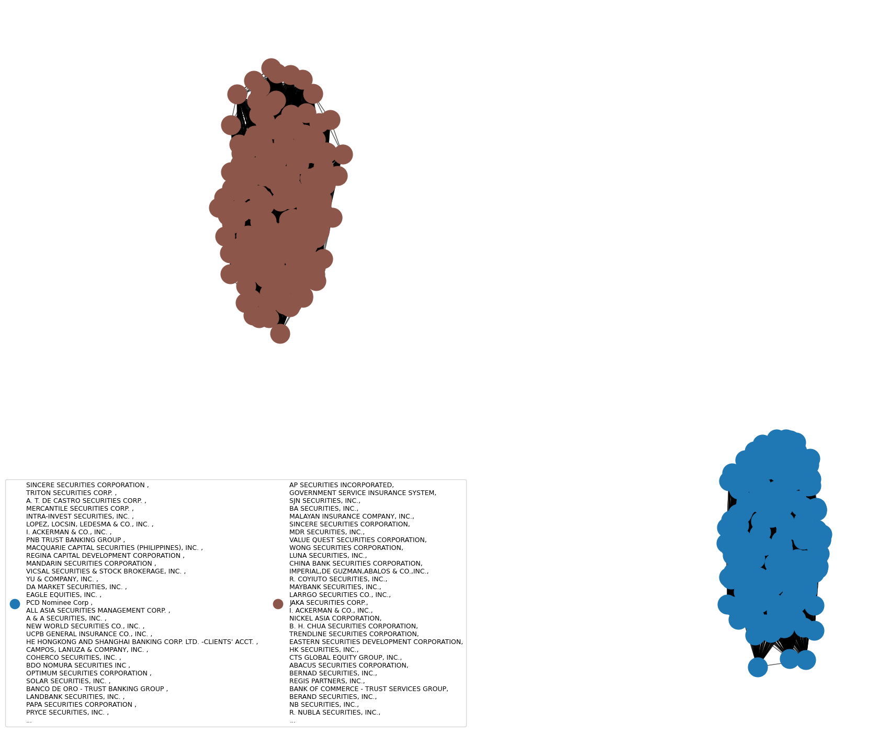

# Network Science Technical Report

## MAPPING INFLUENCE: Exmining PSEi's Top Shareholders

- [View PDF Report](paper.pdf)
- [Download HTML Report](Tech_Report.html)
- [View Notebook](Tech_Report.ipynb)

## Introduction
The Philippine Stock Exchange Index (PSEi) represents the top 30 publicly listed companies on the Philippine Stock Exchange, showcasing the most significant players by market capitalization. To promote transparency, listed companies are mandated to disclose their top 100 shareholders quarterly. This regulation sheds light on key stakeholders, including individual investors, institutional entities, and offshore institutions, whose significant voting power influences corporate policies.

This report leverages network science to analyze shareholder connections and identify the top movers shaping the local stock exchange. By mapping these relationships, we aim to provide deeper insights into the forces driving the PSEi and the broader investment landscape.

## 2019-2024 Bipartite view of listed stocks and shareholders

Offshore institutional investors emerge as the most influential shareholders, reflecting their significant role in shaping the Philippine stock market. This dominance highlights the substantial impact of foreign ownership on corporate policies and market dynamics.

## Local Ownership Rights

Local direct ownership, excluding shares under the Philippine Depository and Trust Corporation (PDC), presents a fragmented and disconnected structure within the PSEi network. The ownership is primarily organized into small clusters or isolated groups, often connected through specific sectors. These local stakeholders exert limited influence across the broader market, with their impact being more sector-specific rather than widespread throughout the entire PSEi.

## PDC Insights

The Philippine Depository & Trust Corporation (PDC) plays a crucial role as a custodian, holding shares on behalf of numerous investors. In the holder-holder projection, PDC's structure reveals a highly interconnected network.

### Network Statistics:

- Nodes: 377
- Edges: 33,606
- Degree Range: 111 to 298
- Average Degree: 178.28
- Average Shortest Path Length: 1.7
- Average Clustering Coefficient: 0.96
- These metrics indicate a densely connected network with strong cohesion among nodes, as shown by the high clustering coefficient. The relatively short average path length of 1.7 suggests that, despite the network's size, most nodes are closely interconnected.

### Centrality Measures

The centrality analysis identifies Benjamin Co Ca & Co. Inc. as a prominent player within the network, with the following scores:

- Degree: 0.792
- Betweenness: 0.499
- Closeness: 0.828
- Pagerank: 0.004

These centrality measures indicate that Benjamin Co Ca & Co. Inc. holds significant influence in terms of connectivity, intermediating between different parts of the network and having a prominent position in the holder-holder structure.

### Additional Insights

- Concentration of Influence: There is a noticeable concentration of influence among a few entities, suggesting that a small group of key players dominate the market dynamics.
- Connected and Clustered Network: The network's connected and clustered structure indicates that a significant number of investors share ownership across multiple entities, leading to a highly interdependent market environment. This interconnectedness reinforces the influence of major stakeholders across the market.